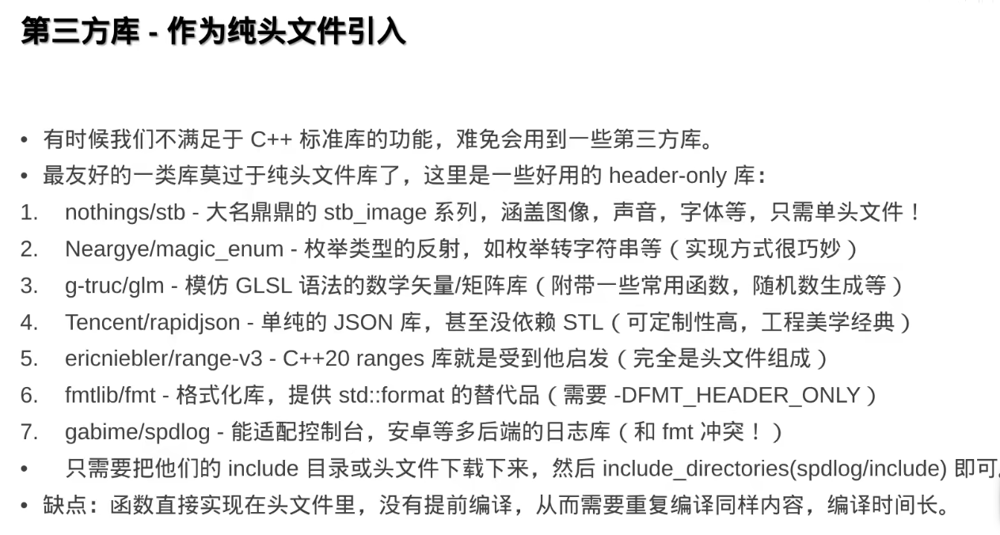
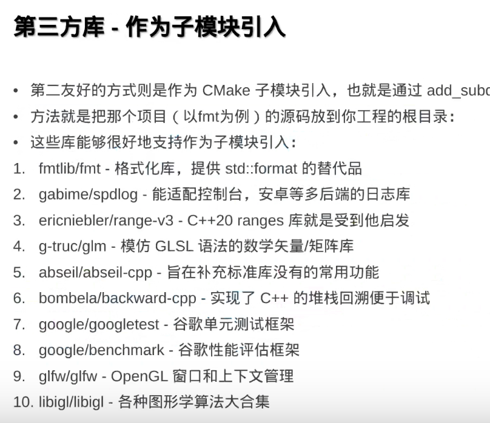

# C++一些常识

####  Library


将相同的功能打包在一起，方便大家一起调用，就成了库。

##### 静态链接库

直接把代码插入可执行文件，参与编译，这样会导致编译出的文件体积变大。

##### 动态链接库

动态链接库只在生成的可执行文件中生成“插装”函数，当程序执行的时候，会将指定dll加载到内存，并替换相应的“插装”指向的地址为加载后的地址，这个过程叫**重定向**。当执行到该函数的时候，会跳转到指定实现中，函数执行完后，再跳回原地址。

对于库的查找，Windows系统和Linux系统有所不同：

##### Windows: 

先查找可执行文件同目录，其次是环境变量中的%PATH%

##### Linux：

ELF格式可执行文件的RPATH,此次是/usr/lib等

### CMake 中的静态库与动态库操作

##### add_library

生成库文件，需通过STATIC,SHARED关键字指定库的类型。

```cmake
add_library(test STATIC source1.cpp source2.cpp) # 生成静态链接库libtest.a
add_library(test SHARED source1.cpp source2.cpp) # 生成动态链接库libtest.so
```


##### target_link_libraries

在某可执行文件中使用该库。

```cmake
target_link_libraries(excu PUBLIC test)# 为excu链接libtest.a
```

##### CMake引入系统安装的第三方库

可以通过find_package 命令寻找系统中的包/库

```cmake
find_package(fmt REQUIRED)
target_link_libraries(excu PUBLIC fmt::fmt)
```

为什么是fmt::fmt？

因为cmake认为包是包含多个库的，又称为组件，

为避免冲突，每个组件都享有独立的命名空间，以：：分割。

linux有自带的包管理器，ubuntu为apt，windows推荐vcpkg。

### 头文件

C++中，函数调用前要声明，若是每个调用之前都要逐个申明，就很麻烦，于是我们可以将声明写在头文件中，需要的时候include一下就好。

##### 递归include头文件

若是两个头文件互相include，就会导致递归include，编译不过。处理的方法有两种。

##### #pragma once

在头文件前面加上一行#pragma once

当预处理器第二次读到同一文件时，就会自动跳过。

##### 像c语言一样

```c
#ifndef XXXX
#define XXXX
.....
#endif
```

提前定义。


### 附录：一些库





